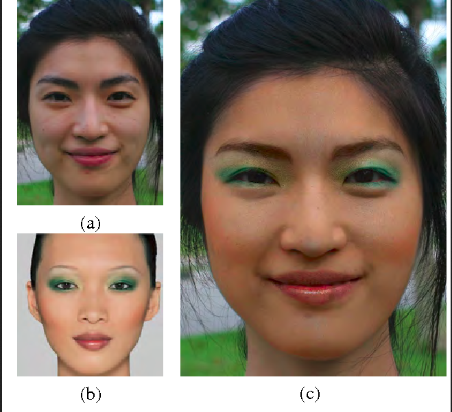

# Software-Engineering-Project
    This project is done as a part of Software Engineering coursework.This applies the make up from a 
    reference image to a target on a pixel by pixel basis. The reference and target were aligned by warping 
    using 77 detected face landmarks. The images were decomposed into large scale layer, detail layer and 
    color layer through which makeup highlights and color information were transferred by weighted means and 
    alpha blending. 
    The test results showed that the techniques work wellwith reference images of a different age, 
    a different skin color and even a hand-sketched reference image.
    

## Installation
* `pip install -r requirements.txt` in the root directory
* `cd React/makeup-frontend/`
* `npm install`

## Running the project
#### Backend
- `python app.py`
#### Frontend
- `cd React/makeup-frontend/`
- `npm start`

## Contributing
     
      * Fork the project.
      * Clone this repository to your local machine.
      * Now add upstream by using command - **git remote add upstream "name of my repo"**
      * Create a new branch on your local machine.
      * Start contributing and make a pull request to apply these changes.
   

See also the list of [contributors](https://github.com/ParthGoyal1508/Software-Engineering-Project/graphs/contributors) who participated in this project.

## Refrences
[DigitalFace Makeup by Example](https://www.comp.nus.edu.sg/~tsim/documents/face_makeup_cvpr09_lowres.pdf) by Dong Guo and Terence Sim